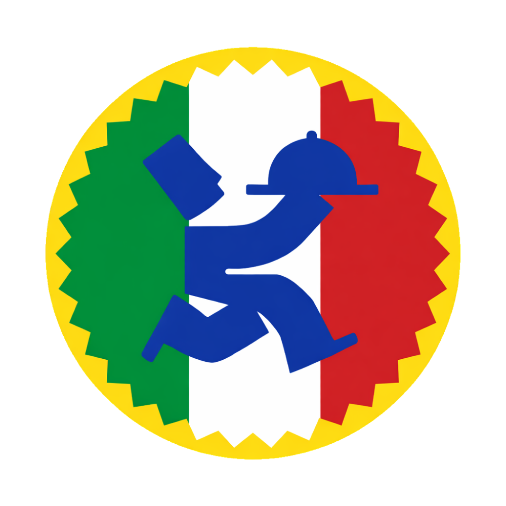

# Cucina-Nostra

<p align="center">
  
</p>

<h1 align="center"> Cucina Nostra</h1>

<p align="center">
  <i>Onde você encontra o melhor da Culinária Italiana. Descubra, vote e compartilhe as receitas que aquecem o coração e a alma.</i>
</p>

---

## 🎓 Sobre o Projeto

O **Cucina Nostra** é uma plataforma interativa focada no compartilhamento de receitas italianas. Desenvolvido como projeto acadêmico para a disciplina de **Gestão de Conteúdo Web**, ministrada pela **Profª Edilma Bindá**.

O objetivo do sistema é permitir que os amantes da culinária não apenas consumam conteúdo, mas construam juntos um acervo gastronômico através de um sistema dinâmico de sugestões e votações.

👨‍💻 **Desenvolvido por:** João Gabriel Tavares de Lira

---

## 🎨 Design (Figma)

O design premium e a interface de usuário (UI) foram inteiramente prototipados no Figma antes da codificação, utilizando conceitos de Glassmorphism, Gradients e tipografia elegante (*Playfair Display* e *Poppins*).

🔗 **[Clique aqui para ver o protótipo no Figma]**[(COLOQUE_SEU_LINK_DO_FIGMA_AQUI)](https://www.figma.com/design/9tyNAS3SJjgAQ19phRiXVs/Cucina-Nostra?node-id=0-1&t=JAhRGXF1OlQgEuLb-0)

---

## ✨ Funcionalidades

- **Autenticação:** Sistema completo de Cadastro e Login de usuários com criptografia de senhas (`password_hash`).
- **Listagem Dinâmica:** Receitas organizadas por categorias (Massas, Pizzas, Doces e Carnes).
- **Sistema de Votação:** Usuários logados podem votar em suas receitas favoritas (com bloqueio de voto duplo).
- **Ranking:** A página inicial destaca automaticamente as receitas mais votadas pela comunidade.
- **Sugerir Receitas:** Formulário interativo para usuários enviarem suas próprias receitas, incluindo **upload de imagens** direto para o servidor.
- **Busca e Filtros:** Barra de pesquisa por nome do prato ou do Chef, além de filtros por categoria.
- **Página de História:** Seção dedicada à cultura gastronômica italiana com player de vídeo integrado.
- **Design Responsivo:** Interface adaptável para celulares, tablets e desktops.

---

## 🚀 Tecnologias Utilizadas

- **Front-end:** HTML5, CSS3, Bootstrap 5, JavaScript (Vanilla).
- **Back-end:** PHP 8 (Puro/Estruturado com conceitos de MVC).
- **Banco de Dados:** MySQL (utilizando PDO para maior segurança contra SQL Injection).
- **Design:** Figma.

---

## 🛠️ Como rodar o projeto localmente

Siga os passos abaixo para testar o projeto na sua máquina:

1. **Pré-requisitos:** Tenha o [XAMPP](https://www.apachefriends.org/) (ou WAMP) instalado.
2. **Clone o repositório:**
   ```bash
   git clone [[https://github.com/joaogablira/Cucina_Nostra.git]](https://github.com/joaogablira/Cucina-Nostra.git)
